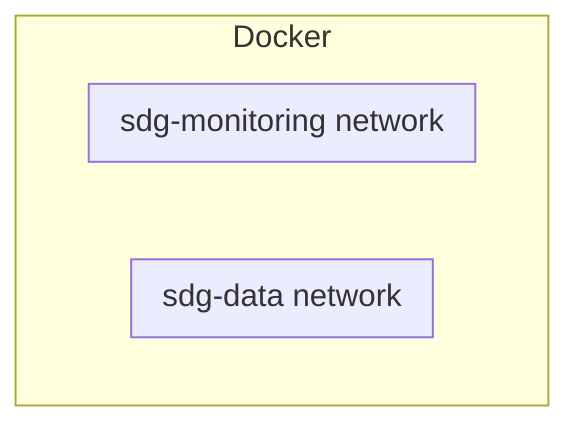

# SDG Tech Challenge — Local Data Platform

Local data platform built with **Terraform + Docker**: MinIO object storage and PostgreSQL.

## Architecture

```mermaid
flowchart TB
    subgraph docker["Docker"]
        direction LR
        subgraph sdg-data["sdg-data network"]
        end
        subgraph sdg-monitoring["sdg-monitoring network"]
        end
    end
```
